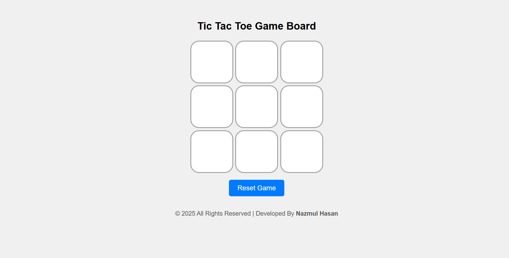

# 🎮 Tic Tac Toe Game

A simple and fun **Tic Tac Toe** game built using **HTML**, **CSS**, and **JavaScript**. This project supports two players, provides win/draw notifications, and includes reset & new game functionality. Designed with a clean UI and smooth interactions.

---

## 📷 Screenshot

 <!-- Add your own screenshot image -->

---

## 🚀 Features

- ✅ Interactive 3x3 game board  
- ✅ Two-player support (X and O turns)  
- ✅ Winner detection and draw message  
- ✅ Reset and New Game buttons  
- ✅ Clean and responsive layout  
- ✅ Fully functional in all modern browsers  

---

## 🛠️ Technologies Used

- **HTML5** – For structuring the page  
- **CSS3** – For styling the layout and components  
- **JavaScript** – For game logic and interactions  

---

## 🧩 How to Play

1. Open the game in your browser.
2. Players take turns clicking on empty cells.
3. First to align 3 marks (vertically, horizontally, or diagonally) wins.
4. If all 9 cells are filled with no winner, the game ends in a draw.
5. Click **"Reset Game"** or **"New Game"** to play again.

---

## 🧑‍💻 Installation / Setup

1. **Clone the repository**
   ```bash
   git clone https://github.com/devnhpiash/tictactoe-game.git
   ```
2. **Navigate to the project folder**
   ```bash
   cd tictactoe-game
   ```
3. **Open `index.html` in your browser**
   - You can simply double-click on the `index.html` file or use a local server like Live Server in VS Code.

---

## 📁 Project Structure

```
tictactoe-game/
├── index.html
├── style.css
├── script.js
├── screenshot.png
└── README.md
```

---

## 🙌 Contributing

Contributions, issues, and feature requests are welcome!  
Feel free to check the [issues page](https://github.com/devnhpiash/tictactoe-game/issues) if you'd like to collaborate.

---

## 📄 License

This project is open source and available under the [MIT License](LICENSE).

---

## 📬 Contact

If you like this project or have any questions, feel free to reach out!

- GitHub: [@devnhpiash](https://github.com/devnhpiash)
- Email: developer.nhpiash@gmail.com

---

✨ Have fun playing and customizing the game!
